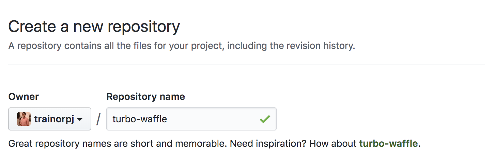

# Turbo Waffle

Turbo-powered waffle bundler for node projects.

## Installation

```
npm install turbo-waffle --save-dev
```

## Usage

Add the number of waffles you'd like to make to following to your `package.json`:

```json
{
  "waffles": 42
}
```

Add the following to your scripts in `package.json`:

```json
{
    "scripts": {
        "turbo-waffle": node turbo-waffle/index.js
    }
}
```

Then run `npm run turbo-waffle`.

The output should be in your root directory as `waffle.build.json`.

## Why?

Because Github dared me to. See the tweet below:


